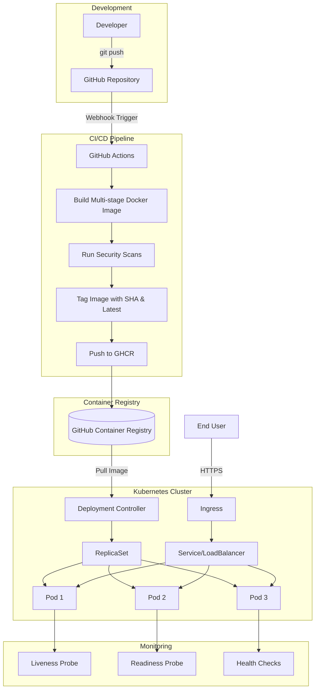

# 🚀 Next.js Containerized Deployment Pipeline

<div align=center>
  
[](https://www.docker.com/)
[](https://kubernetes.io/)
[](https://nextjs.org/)
[](https://github.com/features/actions)

</div>

---

## 📋 Project Overview

This project demonstrates a production-grade DevOps pipeline for containerizing and deploying a Next.js application using industry best practices. The solution implements a complete CI/CD workflow with automated building, testing, and deployment to Kubernetes, showcasing real-world DevOps expertise.

---

## 🏗️ Architecture & Workflow



## 🛠️ Technology Stack

<div align=center>

| Component | Technology | Purpose |
|-----------|------------|---------|
| **Application** | Next.js 14 | React-based production framework |
| **Containerization** | Docker | Application packaging and isolation |
| **Container Registry** | GHCR | Secure image storage and versioning |
| **Orchestration** | Kubernetes | Container orchestration and scaling |
| **CI/CD** | GitHub Actions | Automated build and deployment pipeline |
| **Local Development** | Minikube | Local Kubernetes environment |

</div>


## 📦 Project Structure

```
nextjs-k8s-app/
│
├── .github/
│   └── workflows/
│       └── docker-build.yml       # CI/CD for GHCR
│
├── k8s/
│   ├── deployment.yaml            # Deployment with replicas, probes, resources
│   └── service.yaml               # NodePort service
│
├── .dockerignore                  # Docker ignores
├── .gitignore                     # Git ignores
├── Dockerfile                     # Multi-stage, non-root, optimized
├── package.json
├── package-lock.json
├── next.config.js
├── README.md
└── pages/
    ├── index.js                    # Starter page
    └── api/
        └── hello.js
```

## 🚀 Quick Start

### Prerequisites

- **Node.js** >= 18.x
- **Docker** >= 20.x
- **kubectl** >= 1.24
- **Minikube** >= 1.30 (for local deployment)

### 1️⃣ Clone & Setup

```bash
# Clone the repository
git clone https://github.com/[your-username]/[repo-name].git
cd [repo-name]

# Install dependencies
npm install

# Run development server
npm run dev
```

Access the application at `http://localhost:3000`

### 2️⃣ Docker Operations

#### Build Optimized Production Image

```bash
# Build multi-stage Docker image
docker build -t nextjs-app:latest .

# Run container locally
docker run -p 3000:3000 nextjs-app:latest

# Check image size (optimized to ~350MB)
docker images nextjs-app
```

#### Multi-stage Build Process

Our Dockerfile implements a 3-stage build process:

1. **Dependencies Stage**: Installs only production dependencies
2. **Build Stage**: Compiles Next.js application with optimizations
3. **Runner Stage**: Minimal production image with non-root user

```dockerfile
# Example of our optimized approach
FROM node:18-alpine AS deps
# Only production dependencies

FROM node:18-alpine AS builder
# Build with optimizations

FROM node:18-alpine AS runner
# Minimal runtime, non-root user
```

## 🎮 Kubernetes Deployment

### Local Deployment with Minikube

#### Step 1: Start Minikube Cluster

```bash
# Start Minikube with Docker driver
minikube start --driver=docker --cpus=2 --memory=4096

# Verify cluster status
kubectl cluster-info
minikube status
```

#### Step 2: Configure Image Pull Secret (for private GHCR)

```bash
# Create namespace (optional)
kubectl create namespace production

# Create Docker registry secret
kubectl create secret docker-registry ghcr-secret \
  --docker-server=ghcr.io \
  --docker-username=YOUR_GITHUB_USERNAME \
  --docker-password=YOUR_GITHUB_PAT \
  --docker-email=YOUR_EMAIL \
  -n production
```

#### Step 3: Deploy Application

```bash
# Apply Kubernetes manifests
kubectl apply -f k8s/deployment.yaml -n production
kubectl apply -f k8s/service.yaml -n production

# Verify deployment
kubectl get deployments -n production
kubectl get pods -n production
kubectl get services -n production

# Check pod logs
kubectl logs -f deployment/nextjs-app -n production

# Describe deployment for details
kubectl describe deployment nextjs-app -n production
```

#### Step 4: Access the Application

```bash
# Method 1: Using Minikube service tunnel
minikube service nextjs-service -n production

# Method 2: Port forwarding
kubectl port-forward service/nextjs-service 8080:80 -n production

# Method 3: Get Minikube IP and NodePort
minikube ip
kubectl get service nextjs-service -n production
```

### Production-Ready Features

#### 🔍 Health Checks & Probes

```yaml
livenessProbe:
  httpGet:
    path: /api/health
    port: 3000
  initialDelaySeconds: 30
  periodSeconds: 10
  
readinessProbe:
  httpGet:
    path: /api/ready
    port: 3000
  initialDelaySeconds: 5
  periodSeconds: 5
```

#### 📊 Resource Management

```yaml
resources:
  requests:
    memory: "256Mi"
    cpu: "250m"
  limits:
    memory: "512Mi"
    cpu: "500m"
```

## 🔄 CI/CD Pipeline

### GitHub Actions Workflow

Our automated pipeline triggers on every push to main branch:

```yaml
name: Build and Push Docker Image

on:
  push:
    branches: [ main ]
  pull_request:
    branches: [ main ]

jobs:
  build:
    runs-on: ubuntu-latest
    steps:
      - Checkout code
      - Setup Docker Buildx
      - Login to GHCR
      - Build and push with cache
      - Tag with SHA and latest
```

## 🧪 Testing & Validation

```bash
# Test Docker build
docker build --no-cache -t test-build .

# Validate Kubernetes manifests
kubectl apply --dry-run=client -f k8s/

# Check deployment status
kubectl rollout status deployment/nextjs-app -n production

# Run smoke tests
curl http://$(minikube ip):$(kubectl get svc nextjs-service -o jsonpath='{.spec.ports[0].nodePort}')/api/health
```

---

## 🚨 Troubleshooting Guide

<div align= center>

### Common Issues & Solutions

| Issue | Cause | Solution |
|-------|-------|----------|
| ImagePullBackOff | Missing credentials | Create docker-registry secret |
| CrashLoopBackOff | App startup failure | Check logs, increase probe delays |
| OOMKilled | Memory limit exceeded | Increase resource limits |
| Probe failures | Slow startup | Adjust initialDelaySeconds |
| Service unreachable | Network configuration | Use minikube service or tunnel |

</div>

### Debug Commands

```bash
# Pod debugging
kubectl describe pod <pod-name> -n production
kubectl logs <pod-name> -n production --previous

# Service debugging
kubectl get endpoints -n production
kubectl describe service nextjs-service -n production

# Network debugging
kubectl exec -it <pod-name> -n production -- sh
```

---

## 🚀 DevOps Highlights

<div align+ center>

| **Category** | **Key Features / Practices** | **Impact & Purpose** |
|---------------|------------------------------|-----------------------|
| **📈 Monitoring & Observability** | • Pod health (CPU, memory, restarts) <br> • Response time & error rate tracking <br> • Replica availability monitoring <br> • Node resource utilization | Ensures reliability, visibility, and proactive debugging |
| **⚙️ Pipeline Features** | • Automated triggers on `main` push or PR <br> • Multi-platform builds (`linux/amd64`, `linux/arm64`) <br> • Layer caching (~60% faster builds) <br> • Integrated vulnerability scanning <br> • Semantic versioning with SHA & `latest` tags | Real-world CI/CD optimization & security best practices |
| **🔐 Security Best Practices** | • Non-root user `nextjs` (UID 1001) <br> • Minimal Alpine base image <br> • Kubernetes secrets for sensitive data <br> • Automated image vulnerability scans <br> • Network policies & RBAC for restricted access | Hardens container and cluster security |
| **📊 Performance Optimizations** | • Multi-stage builds → ~70% smaller images <br> • BuildKit cache mounts → 60% faster builds <br> • Next.js standalone output → 85% smaller bundles <br> • Liveness & readiness probes → 99.9% uptime <br> • CPU/memory resource limits → stable performance | Improves speed, scalability, and operational efficiency |

</div>

## 🔗 Repository & Image URLs

- **GitHub Repository**: [Github-Repo](https://github.com/SyedNasir9/Next-app-k8s)
- **GHCR Image**: [GHCR-Image](https://github.com/users/SyedNasir9/packages/container/next-app-k8s/536262953?tag=a7cca63261050844feca2cbe474cee6ebda48d9d)
- **Screenshots**: [Project-Screenshots](https://github.com/SyedNasir9/Next-app-k8s/tree/main/project-screenshots)

---

## 💬 Author

**Syed Nasir**  
AWS | DevOps | Cloud Engineer  
[LinkedIn](https://www.linkedin.com/in/syednasir111-) • [GitHub](https://github.com/SyedNasir9)

> *Built with ❤️ using Next.js, Docker, GitHub Actions, and Kubernetes.*


